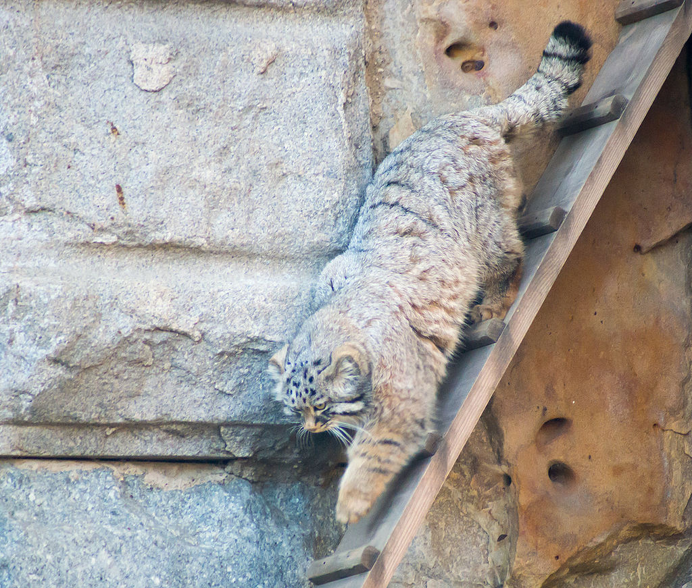

# weblab1
<!DOCTYPE html>
<html>
<head>
	<title>Манул</title>
	<meta charset="utf-8">
	
</head>
<body>
	<h1 align="center">Манул «карликовое ухо»</h1>
	

		<strong>Ману́л</strong> (лат. <em>Otocolobus manul</em>) — хищное млекопитающее семейства кошачьих, единственный вид монотипического рода Otocolobus. Своё второе название — <strong>па́лласов кот</strong> (англ. Pallas's cat) — он получил в честь немецкого натуралиста П. С. Палласа, который впервые описал манула в 1776 году. Латинское название Otocolobus происходит от др.-греч. οὖς, ὠτός ‘ухо’ и κολοβός ‘карлик’, то есть «карликовое ухо». Слово «манул» имеет тюркское происхождение. На основе исследований ДНК предполагается, что этот вид произошёл от предка дикой бенгальской кошки около 5,9 млн. лет назад
	

<h3>Содержание</h3>
  <ol class="content">
    <li><a href="#level2">Внешний вид</a></li>
    <li><a href="#level3">Распространение и подвиды</a></li>
    <li><a href="#level4">Образ жизни и питание</a></li>
    <li><a href="#level5">Размножение</a></li>
    <li><a href="#level6">Статус вида и охрана</a></li>
  </ol>
	<h2 id="level2" align="center">Внешний вид</h2>
	

	
	
Манул — животное размером с домашнюю кошку: длина его тела 52—65 см, хвоста 23—31 см; весит он 2—5 кг. От обычной кошки он отличается более плотным, массивным телом на коротких толстых лапах и очень густой шерстью (на один квадратный сантиметр приходится 9000 волосков, которые могут достигать длины 7 см). Голова у манула небольшая, широкая и уплощённая, с маленькими округлыми широко расставлеными ушами. Глаза жёлтые, зрачки которых при ярком свете в отличие от зрачков глаз домашней кошки не приобретают щелевидную форму, а остаются круглыми. На щеках — пучки удлинённых волос (баки). Хвост длинный и толстый, с закруглённым кончиком.
	Мех у манула самый пушистый и густой среди кошачьих. Окрас меха представляет собой комбинацию светло-серого и палево-охристого цветов; волоски имеют белые кончики, в результате чего создаётся впечатление, что мех манула припорошен снегом. На задней части туловища и на хвосте имеются узкие тёмные поперечные полосы, по бокам морды от углов глаз идут вертикальные чёрные полосы. Кончик хвоста чёрный. Низ тела бурый с белым налётом

	    
	<h2 id="level3" align="center">Распостранение и подвиды</h2>
	

	
	
Манул распространён в Центральной и Средней Азии, от Южного Закавказья и западного Ирана до Забайкалья, Монголии и Северо-Западного Китая.

	
Географическая изменчивость окраски и размеров тела манула невелики, признаются всего три подвида

	<ul>
		<li><em>Otocolobus manul manul</em> — встречается на большей части ареала, но наиболее обычен в Монголии и западном Китае. Обладает типичным окрасом.</li>
		<li><em>Otocolobus manul ferruginea</em> — распространён в Иране, Казахстане, Киргизии, Туркмении, Узбекистане, Таджикистане, Афганистане, Пакистане. Отличается красновато-охристым окрасом, с чёткими красноватыми полосами.</li>
		<li><em>Otocolobus manul nigripecta</em> — обитает в Кашмире, Непале и на Тибете. Для него характерен сероватый окрас шерсти, которая зимой приобретает выраженный серебристо-серый оттенок.</li>
		</ul>
	
В пределах России ареал манула представлен тремя участками: восточным, забайкальским и тувино-алтайским. Первый находится в Читинской области, между реками Шилкой и Аргунью, на западе — до Онона. Здесь распространение манула ограничено степной зоной. Забайкальский очаг расположен в основном в Бурятии, в пределах лесостепных и степных районов: Джидинского, Иволгинского и Селенгинского, до широты Улан-Удэ. В третьем очаге, в Тыве и на Алтае присутствие манула отмечено на крайнем юго-востоке региона. За последние 10—15 лет манул в открытых степях был практически истреблён, и его ареал приобретает вид изолированных очагов.

	
В пределах Азербайджана манулы водятся на территории Зангезурского национального парка.

	<h2 id="level4" align="center">Образ жизни и питание</h2>
	

	
	
Для мест обитания манула характерен резко континентальный климат с низкими температурами зимой и невысоким снежным покровом; наиболее многочисленен он в малоснежных районах. Населяет манул степные и полупустынные участки в горах, мелкосопочниках, межгорных котловинах, особенно с кустарниковыми зарослями, останцами и чинками, наличием каменных россыпей и скальных расселин. В горах поднимается до 3000—4800 м над уровнем моря. В лесном поясе и в низинах редок. Мозаичность его ареала, спорадичность распространения и низкая плотность объясняются относительной стенотопностью (приуроченностью к узкому кругу местообитаний) вида. Повсеместно манул малочислен.

	
Манул ведёт оседлый образ жизни. Активен преимущественно в сумерках и ранним утром; днём спит в укрытии. Логово устраивает в расщелинах скал, небольших пещерах, под камнями, в старых норах сурков, лисиц, барсуков. Окрас манула обладает исключительными камуфлирующими свойствами, помогающими ему в охоте. Сам по себе манул — самый медлительный и неповоротливый из диких котов.

	
Кормится манул почти исключительно пищухами и мышевидными грызунами, изредка ловит сусликов, зайцев-толаев, сурчат и птиц. В летний период, в годы депрессии численности пищух, манул в большом количестве поедает прямокрылых и других насекомых. Добычу ловит, скрадывая её или карауля у камней и нор.

	
Манул не приспособлен к быстрому бегу. При опасности для него характерно затаивание; он также спасается от врагов, забираясь на камни и скалы. Встревоженный манул издаёт хриплое урчание или резкое фырканье.

	<h2 id="level5" align="center">Размножение</h2>
	

		
		
Манулы размножаются один раз в год. Гон проходит в феврале—марте. Беременность длится около 60 дней. Котята рождаются в апреле—мае. В помёте 2—6 котят, реже больше. Длина новорождённого манула — около 12 см, вес — до 300 г; в их окраске заметна тёмная пятнистость. Как и у многих кошачьих, котята манулы рождаются слепыми и полностью беспомощными[9]. Прозревают они на 10—12-й день. В возрасте 3—4 месяцев котята начинают охотиться. Половой зрелости молодые манулы достигают в возрасте около 10 месяцев. Средняя продолжительность жизни манула — 11—12 лет. В июле 2020 года в Новосибирском зоопарке имени Р. А. Шило 3 самки манула принесли потомство, 16 детенышей.

		   
		<h2 id="level6" align="center">Статус вида и охрана</h2>
		

		
Повсеместно, не исключая охраняемые территории, манул редок или крайне редок и его численность продолжает сокращаться. Местами он находится на грани исчезновения. Точная численность вида неизвестна из-за скрытного поведения манула и мозаичности его распространения. По данным экспертов, численность манула в 1989 и 1991 годах оценивалась: в Алтайском крае в 200—300 особей; в Бурятии — 50—70 особей; в Читинской области — 2000—2400 особей. Максимальная плотность животных в отдельных местообитаниях составляла 2,5—3 взрослых особи на 10 км². На рубеже 2000-х годов общая численность манулов в России оценивалась экспертами в 3000—3650 особей

		
		
Характерные места обитания манула (каменистые степи, останцы) сравнительно мало страдают от воздействия человека; наибольшее влияние на его численность оказывают браконьерская охота ради меха, беспривязное содержание собак, массовое использование петель и капканов для отлова зайцев и лисиц. Наряду с воздействием антропогенных факторов отмечается ухудшение кормовой базы ввиду снижения численности сурков и других грызунов. Много зверей, особенно молодых, уничтожают волки и филины; в раннем возрасте велика смертность от инфекционных заболеваний. Существенным лимитирующим фактором являются также многоснежные зимы и продолжительный гололёд.

		
Манул занесён в Красную книгу Российской Федерации, в Красный список МСОП со статусом «близкий к угрожаемому» и в Приложение II Конвенции CITES (1995). Охота на манула повсеместно запрещена.

		
В 2013 году Русское географическое общество поддержало программу «Сохранение манула в Забайкалье», выделив грант на этот проект государственному природному биосферному заповеднику «Даурский». Цель проекта — получить новые сведения об участках обитания, перемещениях манулов, оценить уровень выживаемости котят и взрослых кошек.

		
Манулы довольно успешно размножаются в неволе, хотя зоопарки сталкиваются с проблемой высокой смертности среди детёнышей манула от токсоплазмоза. На 1 января 1988 года в 13 коллекциях зоопарков мира содержалось 35 манулов. Приручению не поддаётся. Из-за слабой изученности экологии манула мероприятия по охране этого вида только разрабатываются.

		

		 
		 

		<footer class="footer">
    P.S. Любите манулов, хочу 100 баллов :)
</body>
</html>
